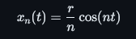
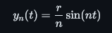
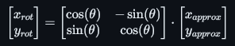

# 📔 Proyecto: Dibujo geométrico con Serie de Fourier [SDF]

Este proyecto muestra cómo se puede utilizar la **serie de Fourier** para generar una figura geométrica mediante la suma de ondas senoidales. En particular, se aproxima la forma de un círculo utilizando senos y cosenos, y luego se rota la figura 90 grados para observar cómo se transforma su orientación. El resultado final recuerda a una medusa estilizada, de ahí su nombre.

## 📌 Objetivo

El objetivo principal del proyecto es demostrar cómo las **series de Fourier** pueden emplearse para **construir y transformar figuras geométricas complejas** utilizando funciones trigonométricas. La figura generada se obtiene sumando términos sinusoidales y luego aplicando una rotación en el plano cartesiano.

---

## ⚙️ Descripción del Algoritmo

El programa `Fourier.py` se estructura en tres grandes bloques:

### 1. **Aproximación con Serie de Fourier**

Se inicializan dos arreglos (`x_approx` y `y_approx`) que almacenarán las coordenadas aproximadas de la figura.

Para cada término `n` de la serie (desde 1 hasta `n_terms`), se suma tal que:

- Una componente de coseno al eje **x**:  


- Una componente de seno al eje **y**:  


Cuantos más términos se sumen, **más precisa será la figura** respecto a un círculo.

### 2. **Rotación de la Figura**

Una vez obtenida la aproximación, se realiza una **rotación de 90° (o π/2 radianes)** usando la matriz de rotación 2D:



Esto da como resultado un cambio de orientación en la figura generada.

### 3. **Visualización gracias a Matplotlib**

Finalmente, se utiliza `matplotlib` para graficar la figura generada. El aspecto es igualado para conservar proporciones.


---

## ❗ Requisitos

Este proyecto está hecho en Python y utiliza las siguientes bibliotecas:

- `numpy`
- `matplotlib`

Puedes instalarlas usando pip si no las tienes:

```bash
pip install numpy matplotlib
```

---

## ✅ Ejecución

¿Cómo ejecutamos el proyecto entonces?

Para ejecutar el programa es muy sencillo:

```bash
python Fourier.py
```

---

## 🖋️ Créditos

* Carlos Adrián Hernández Torres
* Roman Ochoa Oliva